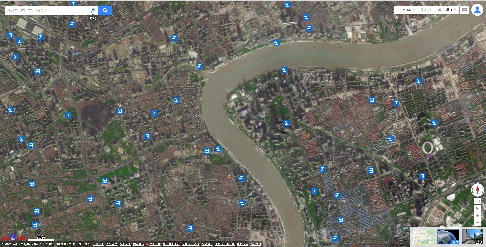
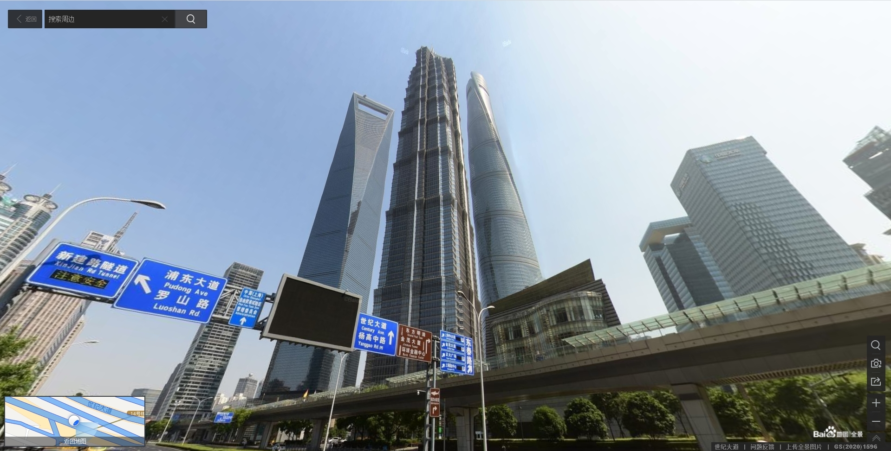
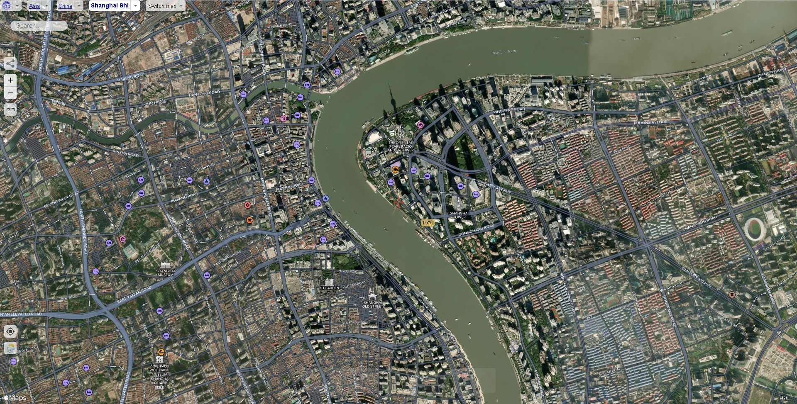

# Navigating Maps 导航地图

## The Best Maps To Use:

#### For Measuring: Google Maps. ([https://bit.ly/35PHB4I](https://bit.ly/35PHB4I))

Google Maps is the only tool that should be used for measuring building position. The website provides builders with a high definition topographic map with the ability to right click to view and copy coordinates. See [how-to-measure-things](how-to-measure-things/ "mention") for more details on how to use TPLL to Measure Buildings.

 (1).png>)

#### For Street View: Baidu Maps. ([https://bit.ly/3IIzqpm](https://bit.ly/3IIzqpm))

Baidu Maps is used predominatly for street view. Builders are able to pick a spot anywhere in most Chinese cities and get a view of that place just as if they were there in real life! This is the go to tool for viewing the buildings you are building and the ground detail surrounding them.

See the Bottom right of Baidu Maps has 3 options:\
1\. Topographic view - no satelite.\
2\. Topographic View - with satelite.\
3\. Topographic View - Click on a street to enter street view.\
\
To get into street view select the third option and the streets with available street view will appear. Click anywhere along those streets and you will be able to view that spot 360 degrees from the street.

#### Additional Topographic Views: Satellites Pro. ([https://bit.ly/3txgnrP](https://bit.ly/3txgnrP))

Sometimes you might want some better topographic maps for the area you are building. Satellites Pro aggregates Apple Maps, Open Street Maps, Google Maps, Esri Map, Mapbox, Yandex Map all together in one place.

&#x20;\


**Good to know:** If you have any questions Message Boojum or .exe on our Discord.&#x20;

